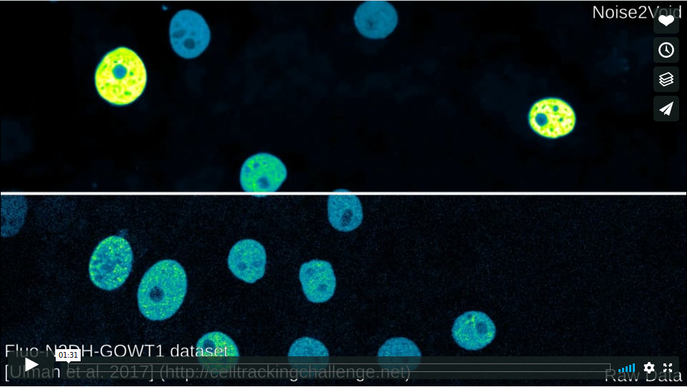

[](https://vimeo.com/305045007)

# Noise2Void - Learning Denoising from Single Noisy Images
Alexander Krull<sup>1,2</sup>, Tim-Oliver Buchholz<sup>2</sup>, Florian Jug</br>
<sup>1</sup><code>krull@mpi-cbg.de</code>, <sup>2</sup>Authors contributed equally

The field of image denoising is currently dominated by discriminative deep learning methods that are trained on pairs of noisy input and clean target images. Recently it has been shown that such methods can also be trained without clean targets. Instead, independent pairs of noisy images can be used, in an approach known as NOISE2NOISE (N2N). Here, we introduce NOISE2VOID (N2V), a training scheme that takes this idea one step further. It does not require noisy image pairs, nor clean target images.  Consequently, N2V allows us to train directly on the body of data to be denoised and can therefore be applied when other methods cannot. Especially interesting is the application to biomedical image data, where the acquisition of training targets, clean or noisy, is frequently not possible.  We compare the performance of N2V to approaches that have either clean target images and/or noisy image pairs available. Intuitively, N2V cannot be expected to outperform methods that have more information available during training. Still, we observe that the denoising performance of NOISE2VOID drops in moderation and compares favorably to training-free denoising methods.

Paper: https://arxiv.org/abs/1811.10980

Our implementation is based on [CSBDEEP](http://csbdeep.bioimagecomputing.com) ([github](https://github.com/csbdeep/csbdeep)).

## Installation
This implementation requires [Tensorflow](https://www.tensorflow.org/install/).
We have tested Noise2Void on LinuxMint 18.3 using python 3.6 and tensorflow-gpu 1.12.0.

#### If you start from scratch...
We recommend using [conda](https://docs.conda.io/en/latest/miniconda.html).
If you do not yet have a strong opinion, just use it too!

After installing Miniconda, the following lines might are likely the easiest way to get Tensorflow and CuDNN installed on your machine (_Note:_ Macs are not supported, and if you sit on a Windows machine all this might also require some modifications.):

```
$ conda create -n 'n2v' python=3.6
$ source activate n2v
$ conda install tensorflow-gpu==1.12
$ pip install jupyter
```

Once this is done (or you had tensorflow et al. installed already), you can install N2V with one of the following two options:

#### Option 1: PIP
```
$ pip install n2v
```

#### Option 2: Git-Clone and install from sources
Or clone the repository:
```
$ git clone https://github.com/juglab/n2v.git
```
Change into its directory and install it:
```
$ cd n2v
$ pip install -e .
```
You are now ready to run Noise2Void.

## How to use it?
Have a look at our jupyter notebook:
* [2D example SEM](https://github.com/juglab/n2v/tree/master/examples/2D/denoising2D_SEM)
* [2D example RGB](https://github.com/juglab/n2v/tree/master/examples/2D/denoising2D_RGB)
* [3D example](https://github.com/juglab/n2v/tree/master/examples/3D)
